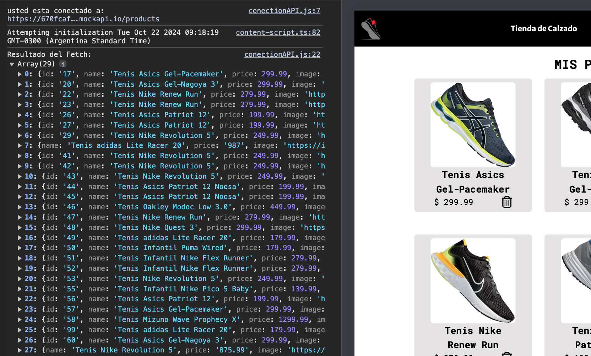
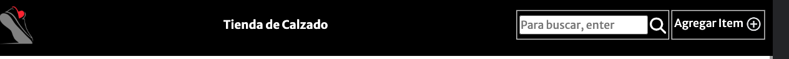
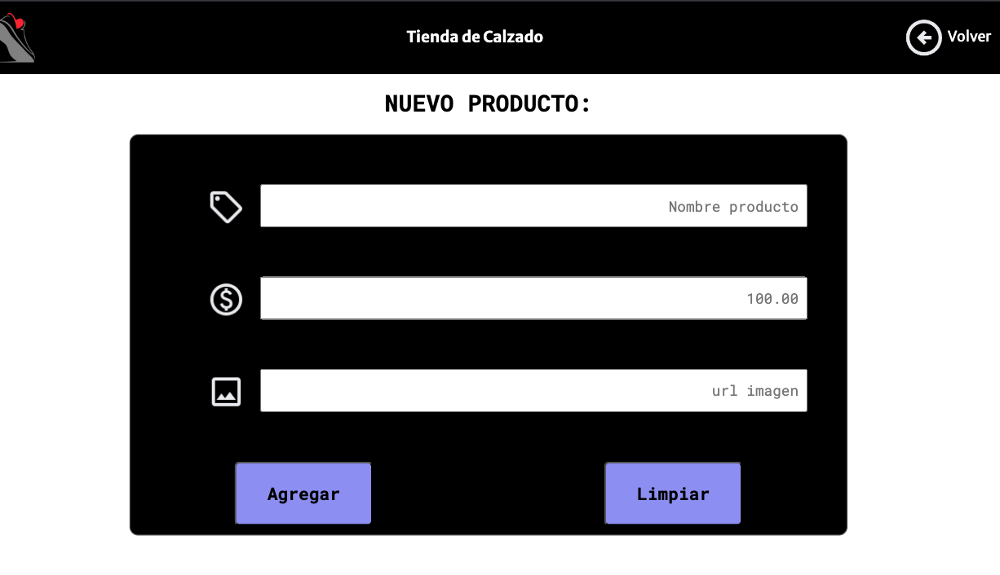
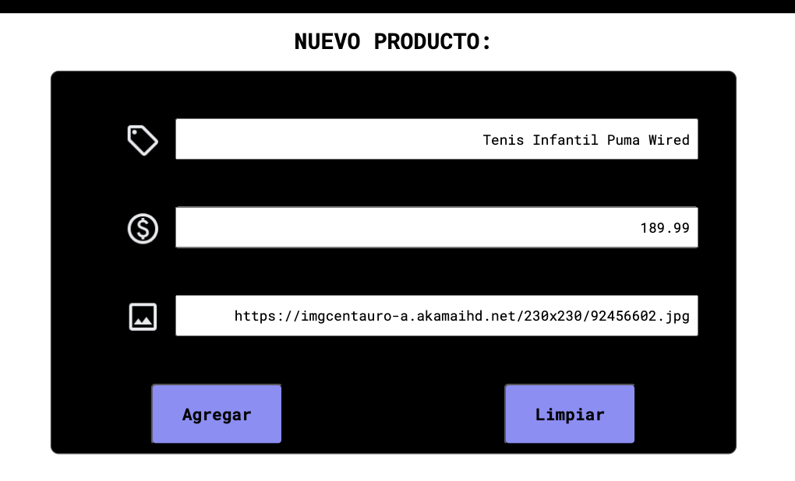
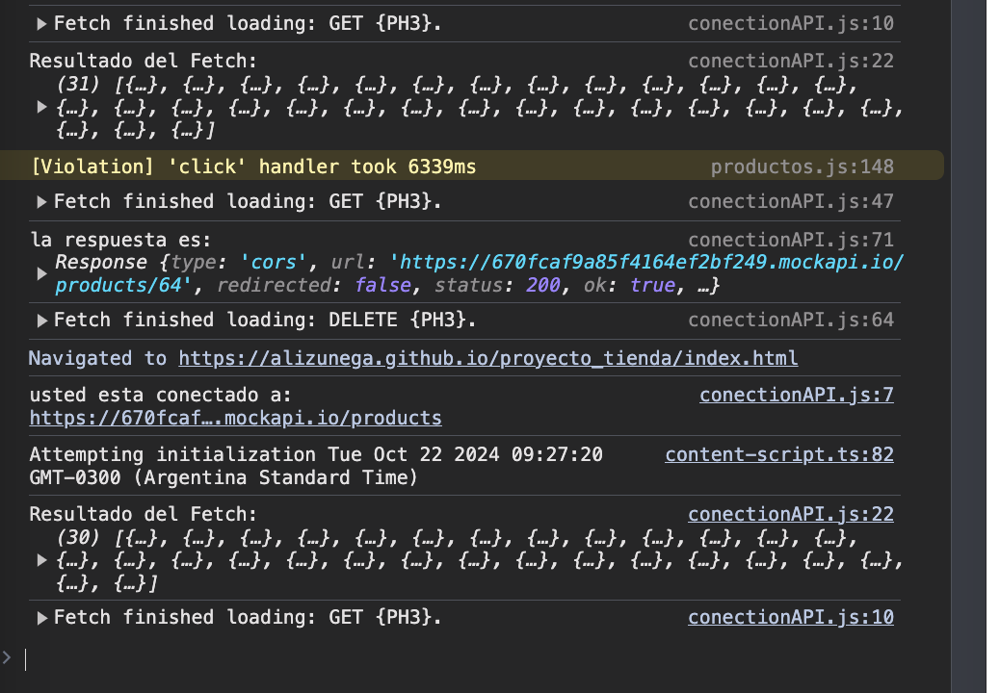

# Proyecto: Challenge AluraGeek

para [Alura ONE](https://github.com/alura-es-cursos)

## Descripción :notebook_with_decorative_cover:

En este desafío desarrollamos una aplicación para listar (muestra una lista de items), registrar (cargar un nuevo item) y eliminar productos usando HTML, CSS y JAVASCRIPT, aplicando conceptos como programación asíncrona, solicitudes HTTP, validación de formularios, manipulación del DOM y otros conceptos avanzados.

## Desarrollado por: :black_nib:

- Alicia Zuñega  
  Perfil GitHub :woman_technologist: [@alizunega](https://github.com/alizunega)  
  Mail :envelope: [ali.zunega@gmail.com](mailto:ali.zunega@gmail.com)

## Despliegue :package:

[_Tienda Alura_](https://alizunega.github.io/proyecto_tienda/)

## Consideraciones generales del proyecto. :warning:

> [!NOTE]
>
> Este proyecto fue desarrollado con el objetivo de cumplir con los requisitos del desafío.
>
> En entorno de producción utilizaremos un server fake haciendo uso del recurso [MockAPI](https://mockapi.io/)
>
> Al ser un recurso free, contamos con limitaciones. Por ejemplo, en tiempo de respuesta.
>
> En el entorno de desarrollo, para prueba de uso local, nos serviremos de archivo `db.json` utilizando `json-server` para simular el uso de servidor remoto.

## Consideraciones iniciales :memo:

> [!IMPORTANT]
>
> En este proyecto trabajamos instalando `Node.js` para poder hacer uso de la herramienta `npm`. Se recomienda su previa instalación. Revise las versiones compatibles.
>
> Revise el formato recomendado para el ingreso de datos, por ejemplo: url de imágenes deben ser url válida ej: `http://ejemploUrl.com`, el formato de precio es solo numeros con el '.' como simbolo decimal.
>
> El proyecto se encuentra en desarrollo, por lo que puede haber errores o problemas que no se han detectado aun. Sientase libre de comentarlos por dm o mail si lo necesita.

### Instalación y Uso :computer:

1- Clona el repositorio:

`git clone https://github.com/alizunega/proyecto_tienda.git `

2- Navega al directorio del proyecto:

`cd proyecto_tienda`

3- Instala dependencias necesarias segun `package.json`.

`npm install`

4- Selecciona la rama develop para trabajar con entorno local

`git checkout develop`

5- Inicia el servidor

`npm run start`

6- Levanta el archivo index.html con la Extensión `Live Server` para ver la página en funcionamiento.

7- Puedes interactuar con la aplicación y ver en funcionamiento la página.
Comprobaras la carga de items desde db.json, podras agregar items y eliminarlos.
Comprueba también la busqueda por palabra clave.

8- En `conectionAPI.js`, puedes modificar la constante `url` para trabajar localmente con el servidor simulado en `mockAPI`. Para ello, simplemente comenta la URL de desarrollo (la que tiene el formato `localhost:3000`) y descomenta la de producción. Por defecto, la aplicación utiliza la URL del archivo `db.json` local.

Es importante destacar que, aunque estés ejecutando la página desde tu entorno local, la aplicación puede estar configurada para consumir datos desde una API remota (en este caso, `mockAPI`). Esto permite simular interacciones con un servidor real mientras desarrollas y pruebas tu aplicación.

En ese caso el paso 6 no será necesario.

9- Consideración especial: si trabajas en la rama `main` no funcionará correctamente, recomiendo usar develop para trabajar en local. `main` es exclusivo para entorno de producción.

## Estructura de carpetas :open_file_folder:

```
proyecto_tienda
├── src
|   ├── css
│   └── js
├── pages
│   ├── addok.html
│   └── formulario.html
├── assets
│   ├── iconos
│   ├── img
│   └── productos
├── index.html
├── db.json
├── package.json
├── LICENSE
└── README.md
```

## Construido Con :hammer_and_wrench:

<div align="center" background-color="white">
  
  
  
  
  
</div>

## Capturas ejemplo de uso :camera:

<section style="display: flex; flex-direction: column; gap: 20px;">
    <figure>
      
      <figcaption>Ejemplo visualizacion: Pantalla carga correcta de items desde API. Muestra url desde donde se sirve.</figcaption>
    </figure>
    <figure>
      
      <figcaption>Ejemplo visualizacion: Botones para buscar un item y cargar nuevo item.</figcaption>
    </figure>
    <figure>
      
      <figcaption>Ejemplo visualizacion: Búsqueda de item por palabra clave. Resultado en consola.</figcaption>
    </figure>
    <figure>
      
      <figcaption>Ejemplo de visualizacion: Formulario carga nuevo item.</figcaption>
    </figure>
    <figure>
      
      <figcaption>Ejemplo de uso: Carga de datos en formulario.</figcaption>
    </figure>
    <figure>
      
      <figcaption>Ejemplo de visualizacion: Página de carga correcta. Resultado en consola.</figcaption>
    </figure>
    <figure>
      
      <figcaption>Ejemplo de visualizacion: Eliminación de un item.</figcaption>
    </figure>
</section>
